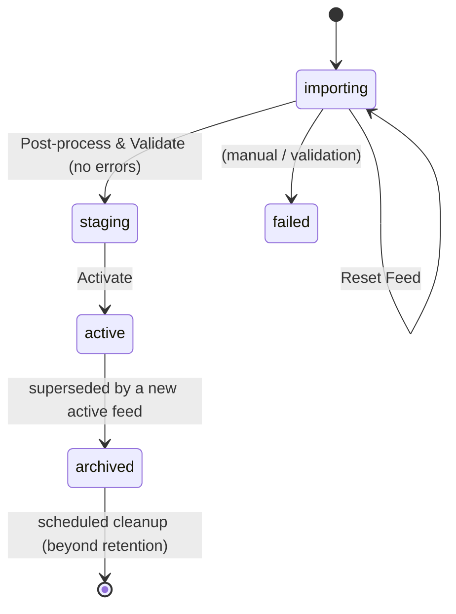

# GTFS Schedule

A scoped ServiceNow application (`x_msag_gtfs_schedu`) that stores a GTFS public-transit
timetable and publishes it through an anonymous Service Portal at **`/gtfs`**.

> **Scope note:** the concept paper named the scope `x_msag_gtfs`, but the SDK derived
> `x_msag_gtfs_schedu` from the app name (30-char limit). Every table/field/record is
> prefixed accordingly (e.g. `x_msag_gtfs_schedu_stop`).

## What it does

- An **admin** imports a GTFS feed (the standard `.txt`/CSV files) through Data Sources,
  transforms it into typed tables, post-processes it (service-day expansion, trip
  metrics), validates it, and activates it.
- **Anonymous visitors** browse the active timetable on the portal: search stops, see a
  departure board, browse routes and trips — with no login.

## Feed lifecycle



At most **one feed is `active`** at a time (enforced by a business rule). The portal always
reads the active feed.

## Architecture

```mermaid
flowchart TD
    subgraph Admin
      DS[8 Data Sources<br/>GTFS - *.txt] --> STG[8 staging tables<br/>imp_*]
      UIA[UI Actions on gtfs_feed] -->|gs.eventQueue| EVT[event feed_op]
      EVT --> SA[Script Action] --> ADM[GtfsAdmin.dispatch]
      ADM --> RUN[GtfsImportRunner]
      ADM --> PP[GtfsPostProcess]
      ADM --> VAL[GtfsValidation]
      ADM --> LC[GtfsLifecycle]
      RUN -->|transform maps| DATA
      PP --> DATA
    end
    subgraph Data[9 data tables, admin-only ACLs]
      DATA[(feed, agency, stop, route, trip,<br/>stop_time, calendar, cal_date, service_day)]
    end
    subgraph Portal[/gtfs - anonymous/]
      W[8 widgets] --> SVC[GtfsPublicService<br/>package_private, not client-callable]
    end
    SVC -->|plain GlideRecord<br/>ACL-bypass, read-only| DATA
```

## Component inventory

| Area | Components |
|---|---|
| **Role** | `x_msag_gtfs_schedu.admin` |
| **Data tables (9)** | `feed`, `agency`, `stop`, `route`, `trip`, `stop_time`, `calendar`, `cal_date`, `service_day` (all `x_msag_gtfs_schedu_*`) |
| **Staging tables (8)** | `imp_agency`, `imp_feed`, `imp_stops`, `imp_routes`, `imp_trips`, `imp_stimes`, `imp_cal`, `imp_caldt` (extend `sys_import_set_row`) |
| **Data Sources (8)** | `GTFS - agency.txt`, `… feed_info.txt`, `… stops.txt`, `… routes.txt`, `… trips.txt`, `… stop_times.txt`, `… calendar.txt`, `… calendar_dates.txt` |
| **Transform maps (8)** | `GTFS Transform - Agency/Feed Info/Stops/Routes/Trips/Stop Times/Calendar/Calendar Dates` |
| **Script Includes** | `GtfsUtil` (pure helpers), `GtfsImportCache` (per-run cache + row handlers), `GtfsImportRunner` (ordered transform chain), `GtfsPostProcess` (service days/metrics/stats), `GtfsValidation` (rule set), `GtfsLifecycle` (activate/reset/cleanup), `GtfsAdmin` (async dispatcher), `GtfsPublicService` (public read API) |
| **Async** | event `x_msag_gtfs_schedu.feed_op` + Script Action `GTFS Feed Operation Dispatcher` |
| **Scheduled job** | `GTFS Feed Cleanup` (hourly, batched deletion of archived feeds beyond retention) |
| **Business rule** | `GTFS - At most one active feed` (before insert/update, `status=active`) |
| **UI Actions** (on `gtfs_feed`) | Start Import, Post-process & Validate, Activate, Reset Feed, Clean Up Archived Feeds |
| **Navigation** | App menu **GTFS Schedule** → Feeds, Create New Feed, GTFS Data Sources, Agencies, Stops, Routes, Trips, Service Days |
| **Portal** | `/gtfs` — theme, login-free header/footer, pages `home`/`stop`/`routes`/`route`/`trip`/`info`, 8 widgets, `gtfsRouteBadge` directive |
| **Security** | 36 admin-only record ACLs (CRUD × 9 data tables); 3 cross-scope privileges (`sys_import_set` read/write, `ImportSetTransformer.transformAllMaps`) |
| **Tests** | ATF suite `GTFS Schedule - Unit & Security` (GtfsUtil + GtfsPublicService guards) |

## Documentation

- **[ADMIN-OPERATIONS.md](./ADMIN-OPERATIONS.md)** — how to import, validate, activate, reset,
  and clean up feeds; troubleshooting; known limitations.
- **[SECURITY.md](./SECURITY.md)** — the anonymous-access security model and review sign-off.
