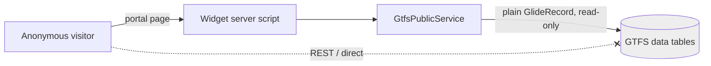

# GTFS Schedule — Security Model

Covers how anonymous visitors read the timetable while the underlying data stays locked
down (concept Section 7.5). This document doubles as the `GtfsPublicService` review
sign-off record (a mandatory go-live checkpoint).

## Principle

> Anonymous users reach GTFS data **only** through `GtfsPublicService`. The tables
> themselves are not directly reachable by any guest-facing channel.

Two independent layers enforce this:

1. **Transport layer.** All data tables have `allowWebServiceAccess: false`, so the REST
   Table API returns 401/403 for everyone — verified anonymously
   (`/api/now/table/x_msag_gtfs_schedu_stop` → denied).
2. **ACL layer.** 36 explicit admin-only record ACLs (read/create/write/delete × 9 data
   tables) require the `x_msag_gtfs_schedu.admin` role, with `adminOverrides`. A guest
   (no roles) is denied. *(WP1's `createAccessControls`/`userRole` produced no ACLs; these
   explicit rules in `src/fluent/security/acls.now.ts` are the real control.)*

## Why the portal still works

`GtfsPublicService` runs in widget **server scripts** using plain `GlideRecord`, which does
**not** enforce record ACLs in a scoped app (only `GlideRecordSecure` and the UI/REST
layers do). So the service is the single sanctioned read path: it bypasses the admin-only
ACLs server-side, while every *other* path (guest UI, REST) stays blocked. The admin-only
ACLs therefore do not break the public portal — verified: after the lockdown the `/gtfs`
routes page still lists routes anonymously, while direct table/REST access is denied.

## GtfsPublicService hardening (review sign-off — PASS)

| 7.5 requirement | Evidence | Verdict |
|---|---|---|
| Not client-callable (no GlideAjax) | `clientCallable: false`; does not extend `AbstractAjaxProcessor` | ✅ |
| Not reachable cross-scope | `accessibleFrom: 'package_private'` | ✅ |
| Whitelisted methods only | Fixed public surface: `getFeedInfo`, `searchStops`, `getNearbyStops`, `getStop`, `getDepartures`, `getRoutes`, `getRoute`, `getRouteTrips`, `getTrip`. No generic query entry point | ✅ |
| Inputs type-checked & bounded | `_str`/`_int`/`_float`/`_direction` guards; search 3–40 chars & ≤20 results, nearby radius ≤2000 m & lat/lon range-checked, departures ≤50, routes ≤500, routeTrips ≤300, tripStops ≤150 | ✅ |
| `addQuery(field, op, value)` only | Operators hardcoded; user text passed as the **value**; `IN` lists built from DB-derived sys_ids; no `addEncodedQuery` of user input | ✅ |
| Active-feed scoped | Every query filters `feed = <active feed>`; `.get(sysId)` only on sys_ids already fetched within feed scope | ✅ |
| Minimal field return | Returns GTFS business ids (`stop_id`/`route_id`/`trip_id`) + display fields; no `sys_id`s / internal fields; internal sort helpers stripped | ✅ |
| Injection resistance | GTFS ids with `^ = ' %` are literal `addQuery` values (cannot alter query structure); search input normalized to `[a-z0-9 ]`; no `eval`, no dynamic table names | ✅ (by construction) |

**Verdict: PASS.** Backed by the ATF suite `GTFS Schedule - Unit & Security`
(3-char guard, injection-safe params, bounds, fail-safe unknown ids).

### Residual recommendations (non-blocking)

1. **Server-side rate limiting.** The service bounds per-call cost but not call frequency;
   client widgets debounce, which is not a server control. Consider instance-level
   anonymous-request throttling before high-traffic go-live.
2. **Internal `_`-helpers are not truly private** (JavaScript). Low risk given
   package-private + first-party widgets; callers should use only the public methods.
3. **Data-dependent departure behaviors** (last-stop excluded, `pickup_type=1` excluded)
   are verified live but not in the ATF suite (they need a controlled active feed). Add a
   fixture-based test in a future iteration.

## Admin-side access

- The **`x_msag_gtfs_schedu.admin`** role gates the admin module, the feed UI Actions, and
  all table CRUD. The import/post-process/activation pipeline writes via plain
  `GlideRecord`/transform maps, so the admin-only ACLs do not block it.
- The async dispatch (Start Import etc.) relies on cross-scope privileges for
  `sys_import_set` and `ImportSetTransformer.transformAllMaps`
  (`src/fluent/import/cross-scope-privileges.now.ts`).
